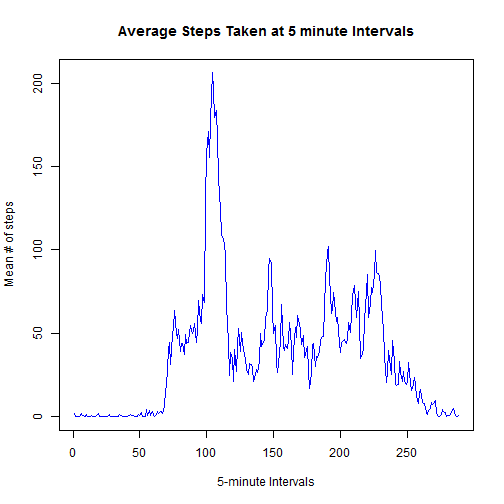
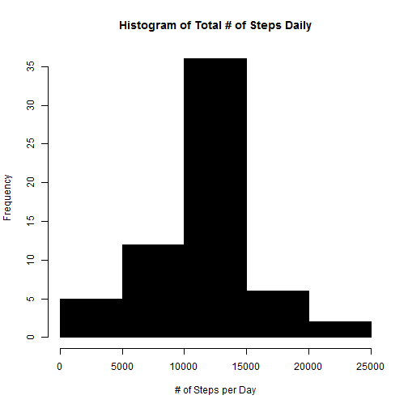
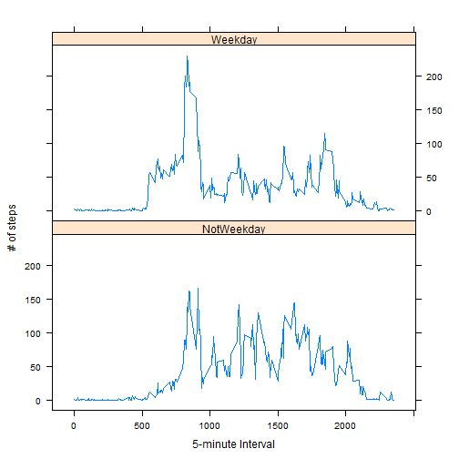

#Assignment Description
The purpose of this assignment was to get familiar with report 
writing by exploring a set of raw data and translating the process into a human readable context.

##Loading and preprocessing the data
####Load the data (i.e. read.csv())
```
df <- read.csv("activity.csv")
```
####Process/transform the data (if necessary) into a format suitable for your analysis
```
df <- as.data.frame(df)
df$date <- as.Date(df$date, "%Y-%m-%d")
```


##What is mean total number of steps taken per day?
###For this part of the assignment, you can ignore the missing values in the dataset.
####Calculate the total number of steps taken per day
```
totalSteps <- aggregate(steps ~ date, data = df, sum, na.rm = TRUE)
```
####Make a histogram of the total number of steps taken each day

```r
hist(totalSteps$steps, col = "red", xlab = "# of Steps per Day", ylab = "Frequency", 
    main = "Histogram of Total # of Steps Daily")
```

 

####Calculate and report the mean and median of the total number of steps taken per day
```
meanSteps <- mean(totalSteps$steps, na.rm = TRUE)
medianSteps <- median(totalSteps$steps, na.rm = TRUE)
```
	
	
##What is the average daily activity pattern?
####Make a time series plot (i.e. type = "l") of the 5-minute interval (x-axis) and the average number of steps taken, averaged across all days (y-axis)

```r
meansteps <- tapply(df$steps, df$interval, mean, na.rm = TRUE)
plot(meansteps, type = "l", xlab = "5-minute Intervals", 
    ylab = "Mean # of steps", main = "Average Steps Taken at 5 minute Intervals", 
    col = "blue")
```

 
####Which 5-minute interval, on average across all the days in the dataset, contains the maximum number of steps?
maxInterval <- meansteps[which.max(meansteps$steps),1]


##Imputing missing values
####Calculate and report the total number of missing values in the dataset (i.e. the total number of rows with NAs)
```
num_NAs <- sum(is.na(df))
```
####Use the mean for that day to fill in missing alues in the dataset
```
avgSteps <- aggregate(steps ~ interval, data = df, FUN = mean)
df_no_NAs <- numeric()
for (i in 1:nrow(df)) {
    obs <- df[i, ]
    if (is.na(obs$steps)) {
        steps <- subset(avgSteps, interval == obs$interval)$steps
    } else {
        steps <- obs$steps
    }
    df_no_NAs <- c(df_no_NAs, steps)
}
```
####Create a new dataset that is equal to the original dataset but with the missing data filled in
```
new_df <- df
new_df$steps <- df_no_NAs
new_df$date <- as.Date(new_df$date, "%Y-%m-%d")
totalSteps <- aggregate(steps ~ date, data = new_df, sum, na.rm = TRUE)
```
####Make a histogram of the total number of steps taken each day

```r
hist(totalSteps$steps, col = "black", xlab = "# of Steps per Day", ylab = "Frequency", 
main = "Histogram of Total # of Steps Daily")
```

 
####Calculate and report the mean and median total number of steps taken per day
```
meanSteps <- mean(totalSteps$steps, na.rm = TRUE)
medianSteps <- median(totalSteps$steps, na.rm = TRUE)
```

##Are there differences in activity patterns between weekdays and weekends?
####Create a new factor variable in the dataset with two levels – “weekday” and “weekend” indicating whether a given date is a weekday or weekend day
```
isWeekday <- integer()
day <- weekdays(new_df$date)
isWeekday <- vector()
for (i in 1:nrow(new_df)) {
    if (day[i] == "Saturday") {
        isWeekday[i] <- "NotWeekday"
    } else if (day[i] == "Sunday") {
        isWeekday[i] <- "NotWeekday"
    } else {
        isWeekday[i] <- "Weekday"
    }
}
new_df[["IsWeekday"]] <- isWeekday
```
####Make a panel plot containing a time series plot (i.e. type = "l") of the 5-minute interval (x-axis) and the average number of steps taken, averaged across all weekday days or weekend days (y-axis)

```r
library(lattice)
dailySteps <- aggregate(steps ~ interval + isWeekday, data = new_df, mean)
names(dailySteps) <- c("interval", "day_type", "steps")
xyplot(steps ~ interval | day_type, dailySteps, type = "l", layout = c(1, 2), 
    xlab = "5-minute Interval", ylab = "# of steps")
```

 


